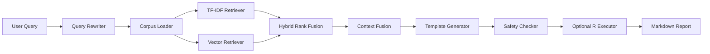

# RStats-Agent-RAG

`RStats-Agent-RAG` 是一个面向 R 统计生态的 local-first Agent + RAG 工程 MVP。它的目标不是做一个简单的 prompt demo，而是把自然语言统计分析需求转成可审计的 R 代码，并同时给出解释、输入假设、可能失败原因、引用片段和执行状态。

项目当前聚焦三类高频 R 统计分析场景：`dplyr` 数据清洗与分组汇总、`ggplot2` 声明式可视化、`lme4` 线性混合效应模型。它用本地语料、确定性 query rewriting、检索、上下文组织和模板生成先跑通一个可测试的 Agent 闭环。

这个项目的设计重点是可复现和可扩展。v0.1 先建立本地 Agent/RAG 骨架；v0.2 把知识来源从 handwritten fixtures 扩展到 CRAN package page metadata，并加入 license ledger；v0.3 在此基础上加入 embedding backend、本地 vector index 和 hybrid retrieval，让检索层从关键词原型推进到本地向量检索 RAG 架构。

当前版本仍然不调用在线 LLM，不依赖 OpenAI API，不要求测试联网、下载模型、安装 R、Docker 或 FAISS。所有核心测试保持 deterministic，方便在本地和 CI 中离线回归。

## 项目动机

普通 R 代码生成器容易给出“看起来能跑”的代码，但统计分析更在意方法是否适配、函数语义是否正确、输入数据假设是否清楚、包版本与来源是否可追踪，以及失败时能否暴露诊断线索。

R 生态的知识来源分散在 CRAN package pages、reference manuals、vignettes、源码、示例和官方文档中。对于统计任务来说，代码只是结果的一部分，用户还需要知道为什么这样写、哪些字段必须存在、哪些 NA 或类型问题会导致失败、模型公式里的固定效应和随机效应分别意味着什么。

因此本项目采用 RAG-first，而不是一开始就微调模型或接在线 LLM。这样可以优先保证知识来源可追踪、解释可审计、测试可复现，并为后续更强的生成模型或执行修复 loop 留出清晰接口。

## 这个 Agent 如何工作



- Query Rewriter：把中文/英文自然语言扩展为包名、函数名和统计术语。
- Corpus Loader：优先加载 `data/processed/corpus.jsonl`，不存在时回退到 fixture corpus。
- TF-IDF Retriever：稳定、离线、可测试的词法检索 fallback。
- Vector Retriever：基于 embedding 的本地语义检索。
- Hybrid Rank Fusion：合并 lexical score 和 vector score，当前使用轻量线性融合。
- Context Fusion：按任务包和优先级组织引用片段。
- Template Generator：当前仍使用 deterministic templates，不调用在线 LLM。
- Safety Checker：阻止危险 R 调用。
- Optional Executor：可选 Docker/R 执行；不可用时返回 `skipped`。
- Markdown Report：输出 R 代码、解释、假设、失败原因、引用和诊断信息。

默认 CLI 仍使用 `tfidf` 检索，保证 v0.1/v0.2 行为稳定；需要 hybrid retrieval 时显式传入 `--retriever hybrid`。

## 版本演进

| 版本 | 主题 | 核心新增 | 工程意义 |
| --- | --- | --- | --- |
| v0.1 | Local Agent/RAG MVP | fixture corpus、query rewrite、TF-IDF retrieval、template generator、safety、CLI、Markdown report | 先跑通本地可测试 Agent 闭环 |
| v0.2 | CRAN Official Corpus + License Ledger | CRAN package metadata parser、offline fixtures、processed corpus、license ledger、provenance | 从手写 fixture demo 走向可审计知识库 |
| v0.3 | Embedding Backend + Local Vector Index | local hash embedding、optional sentence-transformers、numpy vector index、optional FAISS、hybrid retrieval | 从关键词检索扩展到本地向量检索 RAG 架构 |

## 当前支持的任务类型

| 任务类型 | 示例需求 | 生成能力 | 解释能力 |
| --- | --- | --- | --- |
| dplyr 数据清洗与汇总 | 删除 `price` 缺失，按 `store` / `month` 汇总 `revenue` | `filter` / `mutate` / `group_by` / `summarise` / `arrange` | 解释字段要求、NA、分组汇总和收入计算 |
| ggplot2 可视化 | `mpg` 散点图，颜色映射 `class`，按 `drv` 分面 | `ggplot` / `aes` / `geom_point` / `facet_wrap` / `labs` | 解释 aesthetic mapping、图层和分面 |
| lme4 混合效应模型 | `Reaction ~ Days + (Days \| Subject)` | `lmer` / `summary` / `fixef` / `ranef` | 解释固定效应、随机效应、随机截距/斜率和重复测量数据 |

## RAG 知识库设计

v0.1 使用 handwritten fixture corpus，保证离线测试稳定。fixture 覆盖 dplyr、ggplot2、lme4 的核心函数和示例。

v0.2 新增 CRAN package page metadata parser，目标包限定为 `dplyr`、`ggplot2`、`lme4`、`renv`。本地可以生成：

- `data/raw/cran_packages.json`
- `data/processed/corpus.jsonl`
- `data/processed/licenses.jsonl`

processed corpus 默认被 `.gitignore` 忽略，由开发者本地生成。`corpus_loader` 会优先加载 processed corpus；如果文件不存在，则 fallback 到 `rstats_agent/knowledge/fixtures/r_core_corpus.jsonl`。

license ledger 用于记录 package、version、license、source_url、provenance、published、captured_at 等信息。v0.2 只采集 CRAN package page metadata，不解析完整 PDF/vignette 正文，不下载源码 tarball。

## v0.3 向量检索设计

`EmbeddingBackend` 是统一抽象，用于替换不同 embedding 实现。

- `LocalHashEmbeddingBackend`：deterministic、无模型下载、无网络依赖，是默认离线测试 backend。
- `SentenceTransformerEmbeddingBackend`：optional backend，需要安装 `.[vector]`；测试不会真实下载模型。
- `NumpyVectorIndex`：默认 fallback，本机没有 FAISS 也能构建和测试向量索引。
- `FaissVectorIndex`：optional local index，使用 `IndexFlatIP`，用于更接近真实 dense retrieval 的本地实验。
- `HybridRetriever`：合并 TF-IDF 与 vector search；vector artifacts 不存在时 fallback 到 TF-IDF。

v0.3 不调用在线 LLM，不自动下载 embedding 模型，不要求 FAISS 存在才能通过默认测试。

## 安全与可复现设计

- 默认不执行 R 代码。
- 只有传入 `--execute` 才尝试 Docker/R 执行。
- Docker 不可用或本地镜像不存在时返回 `skipped`。
- 静态安全检查会阻止 `system`、`system2`、`shell`、`download.file`、`install.packages`、`url`、`file.create`、`writeLines`、`sink`、`setwd`、`unlink`、`file.remove` 等危险调用。
- 测试不联网、不依赖 API key、不依赖 Docker/R、不下载 CRAN 包、不下载 embedding 模型。
- vector artifacts、processed corpus、reports 都不提交。

## 快速开始

基础开发环境：

```powershell
py -3 -m pip install -e ".[dev]"
py -3 -m pytest -q
```

可选向量依赖：

```powershell
py -3 -m pip install -e ".[dev,vector]"
```

`faiss-cpu` 和 `sentence-transformers` 只在 `vector` optional dependencies 中，不属于核心依赖。

## CLI Demo

```powershell
py -3 -m rstats_agent.cli "请用 dplyr 清洗销售数据，删除 price 缺失或小于等于 0 的行，按 store 和 month 汇总 revenue" --no-execute
```

```powershell
py -3 -m rstats_agent.cli "请用 ggplot2 对 mpg 画 displ 和 hwy 的散点图，颜色映射 class，并按 drv 分面" --no-execute
```

```powershell
py -3 -m rstats_agent.cli "请用 lme4 对 sleepstudy 拟合 Reaction ~ Days + (Days | Subject) 并解释固定效应和随机效应" --no-execute
```

可选 hybrid retrieval：

```powershell
py -3 -m rstats_agent.cli "请用 dplyr 清洗销售数据，按 store 和 month 汇总 revenue" --retriever hybrid --no-execute
```

如果没有本地向量 artifacts，hybrid 会清晰 fallback 到 TF-IDF。

## 示例输出说明

CLI 会输出 Markdown 报告，包含：

- 用户问题
- 检索到的知识片段 ID
- 生成的 R 代码
- 简洁解释
- 输入数据假设
- 可能失败原因与修复建议
- 引用片段
- 执行状态
- `knowledge_source` / `retriever` diagnostics

## v0.2 CRAN Corpus 构建

离线 fixture 构建流程：

```powershell
py -3 data/crawl_cran_packages.py --offline-fixtures --output data/raw/cran_packages.json
py -3 data/build_corpus.py --input data/raw/cran_packages.json --output data/processed/corpus.jsonl
py -3 data/build_license_ledger.py --input data/raw/cran_packages.json --output data/processed/licenses.jsonl
```

手动真实 CRAN metadata 采集：

```powershell
py -3 data/crawl_cran_packages.py --packages dplyr ggplot2 lme4 renv --output data/raw/cran_packages.json
```

真实联网抓取只应由开发者手动运行；测试不会访问网络。

## v0.3 Vector Index 构建

默认 local-hash + numpy 构建：

```powershell
py -3 data/build_vector_index.py --backend local-hash --index-backend numpy --output-dir knowledge/artifacts --query "dplyr filter missing price group_by summarise revenue" --top-k 3
```

可选 FAISS 构建：

```powershell
py -3 -m pip install -e ".[dev,vector]"
py -3 data/build_vector_index.py --backend local-hash --index-backend faiss --output-dir knowledge/artifacts --query "lme4 random effects lmer sleepstudy" --top-k 3
```

如果 FAISS 未安装，FAISS 路径会给出清晰错误；默认测试和 numpy 构建不受影响。

## 目录结构

```text
data/
  build_vector_index.py        # corpus -> local vector index artifacts
  crawl_cran_packages.py       # CRAN package page metadata parser/crawler
  build_corpus.py              # raw package metadata -> processed corpus JSONL
  build_license_ledger.py      # raw package metadata -> license ledger JSONL
knowledge/artifacts/           # generated vector artifacts, ignored except .gitkeep
rstats_agent/
  embeddings/                  # embedding backend protocol and implementations
  agents/                      # Agent orchestration and deterministic generation
  execution/                   # R safety checks and optional execution
  knowledge/                   # corpus loader, TF-IDF, vector index, hybrid retriever
  reporting/                   # Markdown report renderer
tests/                         # deterministic offline tests
```

## 测试

```powershell
py -3 -m pytest -q
```

覆盖范围包括：

- v0.1 Agent pipeline、query rewrite、TF-IDF retriever、generator、safety、executor fallback、Markdown report、CLI
- v0.2 CRAN parser、offline fixtures、processed corpus builder、license ledger、processed-first loader fallback
- v0.3 embedding backends、numpy vector index、optional FAISS behavior、hybrid retriever、vector index build script

## 工程亮点

- Local-first Agent/RAG architecture
- Deterministic offline testing
- CRAN metadata corpus builder
- License ledger and provenance-aware corpus schema
- Processed corpus + fixture fallback
- Embedding backend abstraction
- Local hash embedding for reproducible tests
- Numpy vector index fallback
- Optional FAISS local index
- Hybrid lexical + vector retrieval
- Static R safety guard
- Optional execution fallback
- Clear versioned roadmap

## 当前边界

- 不调用在线 LLM。
- 不做真实大规模 CRAN 爬虫。
- 不解析完整 PDF/vignette 正文。
- 不自动下载 sentence-transformer 模型。
- 不默认要求 FAISS。
- 不替代统计专家审查。
- 当前 generator 是 template-based，不是自由生成模型。
- 当前安全检查是静态规则，不是完整生产级沙箱。

## 面试讲法

- 我不是直接做一个“R Chatbot”，而是先做 RAG 工程底座。
- v0.1 先保证本地 Agent 闭环和可测试性。
- v0.2 把知识来源从 fixture 扩展到 CRAN 官方 metadata，并加入 license ledger。
- v0.3 抽象 embedding backend 和 vector index，使检索层可以从 TF-IDF 扩展到本地向量检索和 hybrid retrieval。
- 整个项目强调 offline deterministic testing，避免 demo 依赖 API key、网络、Docker 或外部模型。
- 这个项目体现了统计知识、R 生态、RAG 工程、测试和安全约束的结合。

## Roadmap

- v0.4：R execution + repair loop。
- v0.5：Web UI / FastAPI。
- v0.6：retrieval evaluation，Recall@k / MRR / nDCG。
- v0.7：more R packages and richer document parsing。
