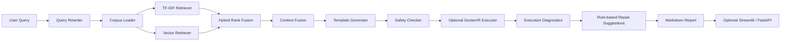

# RStats-Agent-RAG

`RStats-Agent-RAG` 是一个面向 R 统计生态的 local-first Agent + RAG 工程 MVP。它把中文或英文统计分析需求转成可审计的 R 代码，并同时给出解释、输入假设、可能失败原因、引用片段、可选执行状态、结构化诊断、规则化修复建议和 Markdown 报告。

当前版本为 v0.5。v0.5 在 v0.4 的 optional Docker/R execution、structured diagnostics 和 one-shot repair loop 基础上，新增 optional Streamlit interactive demo、optional FastAPI service、built-in demo cases 和 Markdown report download，使项目可以通过 CLI、Web UI 或本地 HTTP API 演示。

项目坚持 local-first 和 offline-test-first：默认不调用在线 LLM，不依赖 OpenAI API 或 API key，不要求测试联网、下载模型、安装 R、安装 Docker、安装 FAISS、安装 sentence-transformers、启动浏览器或启动真实 Web 服务。Docker/R、FAISS、sentence-transformers、Streamlit、FastAPI 和 uvicorn 都是可选能力。

## Agent 如何工作



- Query Rewriter：把自然语言需求扩展为包名、函数名和统计术语。
- Corpus Loader：优先加载 `data/processed/corpus.jsonl`，缺失时 fallback 到 fixture corpus。
- TF-IDF Retriever：稳定、离线、可测试的词法检索。
- Vector Retriever：基于 embedding 的本地语义检索。
- Hybrid Rank Fusion：合并 lexical score 和 vector score。
- Template Generator：当前使用 deterministic templates，不调用在线 LLM。
- Safety Checker：阻止危险 R 调用。
- Optional Executor：只有显式启用执行时尝试 Docker/R，不可用时 graceful skipped。
- Diagnostics + Repair：对 stderr/stdout 做结构化分类，并给出规则化修复建议。
- Web/API：调用同一套 Agent pipeline，只负责交互、JSON 包装和报告下载。

## 版本演进

| 版本 | 主题 | 核心新增 | 工程意义 |
| --- | --- | --- | --- |
| v0.1 | Local Agent/RAG MVP | fixture corpus、query rewrite、TF-IDF retrieval、template generator、safety、CLI、Markdown report | 跑通本地可测试 Agent 闭环 |
| v0.2 | CRAN Official Corpus + License Ledger | CRAN metadata parser、offline fixtures、processed corpus、license ledger、provenance | 从 handwritten fixture demo 走向可审计知识库 |
| v0.3 | Embedding Backend + Local Vector Index | local hash embedding、optional sentence-transformers、numpy vector index、optional FAISS、hybrid retrieval | 从关键词检索扩展到本地向量检索 RAG 架构 |
| v0.4 | R Execution Diagnostics + Repair Loop | optional Docker/R execution、structured diagnostics、rule-based repair suggestions、one-shot repair loop | 从“生成代码”推进到“执行反馈和修复建议”闭环 |
| v0.5 | Interactive Web Demo + FastAPI Service | optional Streamlit UI、optional FastAPI service、built-in demo cases、report download | 从 CLI 原型升级为可展示、可演示、可接口化调用的本地应用 |

## 当前支持任务

| 任务类型 | 示例需求 | 生成能力 | 解释能力 |
| --- | --- | --- | --- |
| dplyr 数据清洗与汇总 | 删除 `price` 缺失，按 `store` / `month` 汇总 `revenue` | `filter` / `mutate` / `group_by` / `summarise` / `arrange` | 解释字段要求、NA、分组汇总和收入计算 |
| ggplot2 可视化 | `mpg` 散点图，颜色映射 `class`，按 `drv` 分面 | `ggplot` / `aes` / `geom_point` / `facet_wrap` / `labs` | 解释 aesthetic mapping、图层和分面 |
| lme4 混合效应模型 | `Reaction ~ Days + (Days \| Subject)` | `lmer` / `summary` / `fixef` / `ranef` | 解释固定效应、随机效应、随机截距/斜率和重复测量 |

## 快速开始

核心开发依赖：

```powershell
py -3 -m pip install -e ".[dev]"
py -3 -m pytest -q
```

可选向量依赖：

```powershell
py -3 -m pip install -e ".[dev,vector]"
```

可选 Web 依赖：

```powershell
py -3 -m pip install -e ".[dev,web]"
```

`faiss-cpu` 和 `sentence-transformers` 只在 `vector` optional dependencies 中。`streamlit`、`fastapi` 和 `uvicorn` 只在 `web` optional dependencies 中。它们都不属于核心依赖。

## CLI Demo

默认不执行 R：

```powershell
py -3 -m rstats_agent.cli "请用 dplyr 清洗销售数据，删除 price 缺失或小于等于 0 的行，按 store 和 month 汇总 revenue" --no-execute
```

```powershell
py -3 -m rstats_agent.cli "请用 ggplot2 对 mpg 画 displ 和 hwy 的散点图，颜色映射 class，并按 drv 分面" --no-execute
```

```powershell
py -3 -m rstats_agent.cli "请用 lme4 对 sleepstudy 拟合 Reaction ~ Days + (Days | Subject) 并解释固定效应和随机效应" --no-execute
```

启用 optional execution + repair：

```powershell
py -3 -m rstats_agent.cli "请用 dplyr 清洗销售数据，删除 price 缺失并按 store 汇总 revenue" --execute --repair --max-repairs 1
```

如果 Docker/R 不可用，输出会显示 `execution_status=skipped` 和原因，不影响核心流程。

可选 hybrid retrieval：

```powershell
py -3 -m rstats_agent.cli "请用 dplyr 清洗销售数据，按 store 和 month 汇总 revenue" --retriever hybrid --no-execute
```

## v0.5 Streamlit Demo

运行：

```powershell
py -3 -m streamlit run app/ui_streamlit.py
```

Streamlit UI 提供：

- 内置 demo case 下拉选择。
- `tfidf` / `hybrid` retriever 选择。
- `execute` 和 `repair` checkbox，默认不执行 R。
- `max_repairs` 和 `top_k` 控制。
- 用户问题输入框。
- generated R code、explanation、assumptions、failure modes、citations / retrieved chunk ids、execution status、diagnostics、repair suggestions 展示。
- Markdown report 下载按钮。

如果 Docker/R 不可用，执行状态会显示 `skipped`，Web demo 不会因此崩溃。如果未安装 Streamlit，UI 模块会提示安装 `py -3 -m pip install -e ".[web]"`。

## v0.5 FastAPI Service

运行：

```powershell
py -3 -m uvicorn app.api_fastapi:app --reload
```

接口文档：

```text
http://127.0.0.1:8000/docs
```

接口：

- `GET /health`：返回服务状态、版本和服务名。
- `GET /demo-cases`：返回内置 demo cases。
- `POST /analyze`：输入 `question`、`retriever`、`execute`、`repair`、`max_repairs` 和 `top_k`，返回 R code、解释、引用、执行状态、诊断、修复建议和 Markdown report。

`/analyze` 默认 `execute=false`。Docker/R 不可用时不失败，而是返回 `skipped`。如果未安装 FastAPI，服务模块会提示安装 `py -3 -m pip install -e ".[web]"`。

## Markdown 报告

CLI、Streamlit 和 FastAPI 都复用同一套 Markdown renderer。报告包含：

- 用户问题
- 检索到的知识片段 ID
- 生成的 R 代码
- 简洁解释
- 输入数据假设
- 可能失败原因与修复建议
- 引用片段
- 执行状态
- 执行诊断
- 修复建议
- Repair Loop Summary
- `knowledge_source` / `retriever` diagnostics

## v0.2 CRAN Corpus 构建

离线 fixture 构建流程：

```powershell
py -3 data/crawl_cran_packages.py --offline-fixtures --output data/raw/cran_packages.json
py -3 data/build_corpus.py --input data/raw/cran_packages.json --output data/processed/corpus.jsonl
py -3 data/build_license_ledger.py --input data/raw/cran_packages.json --output data/processed/licenses.jsonl
```

真实 CRAN metadata 采集只应由开发者手动运行；测试不会访问网络。

## v0.3 Vector Index 构建

默认 local-hash + numpy：

```powershell
py -3 data/build_vector_index.py --backend local-hash --index-backend numpy --output-dir knowledge/artifacts --query "dplyr filter missing price group_by summarise revenue" --top-k 3
```

可选 FAISS：

```powershell
py -3 -m pip install -e ".[dev,vector]"
py -3 data/build_vector_index.py --backend local-hash --index-backend faiss --output-dir knowledge/artifacts --query "lme4 random effects lmer sleepstudy" --top-k 3
```

如果 FAISS 未安装，FAISS 路径会给出清晰错误；默认测试和 numpy 构建不受影响。

## 目录结构

```text
app/
  demo_cases.py
  ui_streamlit.py
  api_fastapi.py
data/
  build_vector_index.py
  crawl_cran_packages.py
  build_corpus.py
  build_license_ledger.py
docs/
  demo_script.md
knowledge/artifacts/
  .gitkeep
rstats_agent/
  embeddings/
  agents/
    repair_loop.py
  execution/
    diagnostics.py
    repair.py
    r_executor.py
    safety.py
  knowledge/
  reporting/
tests/
```

`knowledge/artifacts/` 中生成的索引文件、`data/processed/*.jsonl`、`reports/*.md`、`.test-output/` 和执行日志都不应提交。

## 测试

```powershell
py -3 -m pytest -q
```

测试覆盖 v0.1-v0.5 的核心路径，并保持离线 deterministic。默认测试不依赖浏览器、真实服务器、Docker/R、FAISS、sentence-transformers、网络或 API key。FastAPI 相关测试在依赖可用时使用 `TestClient`，依赖缺失时跳过或验证清晰提示。

## 工程亮点

- Local-first Agent/RAG architecture
- Deterministic offline testing
- CRAN metadata corpus builder
- License ledger and provenance-aware corpus schema
- Processed corpus + fixture fallback
- Embedding backend abstraction
- Numpy vector index fallback and optional FAISS
- Hybrid lexical + vector retrieval
- Static R safety guard
- Optional Docker/R execution
- Structured R error diagnostics
- Rule-based repair suggestions and one-shot repair loop
- Optional Streamlit interactive demo
- Optional FastAPI service
- Built-in demo cases and Markdown report download

## 当前边界

- 不调用在线 LLM。
- 不依赖 OpenAI API。
- 不做真实大规模 CRAN 爬虫。
- 不解析完整 PDF/vignette 正文。
- 不自动下载 sentence-transformer 模型。
- 不默认要求 FAISS。
- 不自动联网安装 R 包。
- 不替代统计专家审查。
- 当前 generator 是 template-based，不是自由生成模型。
- 当前 Docker/R 执行是受限原型，不是生产级安全沙箱。
- 当前 Streamlit/FastAPI 是本地 demo/service 层，不是生产级部署。

## Roadmap

- v0.6：retrieval evaluation，包含 Recall@k / MRR / nDCG。
- v0.7：更多 R 包与更丰富文档解析。
- v0.8：deployment polish / public demo mode。
